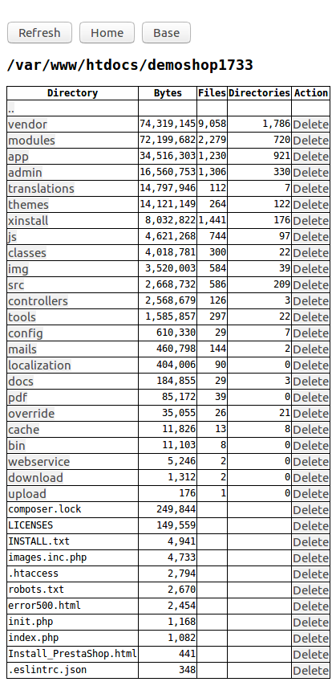

# byteusage
Show number of bytes used for files and directories

Notice that the actual disk usage is not the same as the bytes used. You can use this script to cleanup your web server.

A single PHP file to put on your server. The script calculates the number of bytes, directories and files. You can delete a single file or a directory with all its contents.

You can set the home directory of the script by changing the array $homeDirs. This is the directory the script will initially display.

Only files listed as $homeDirs can be listed or be deleted.

